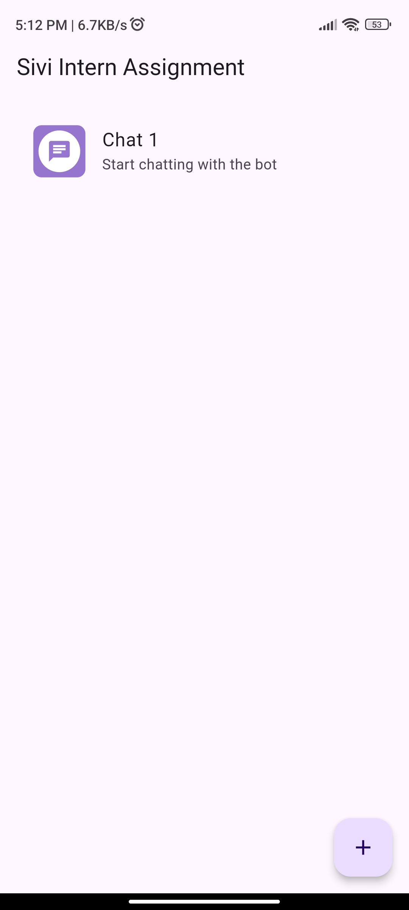
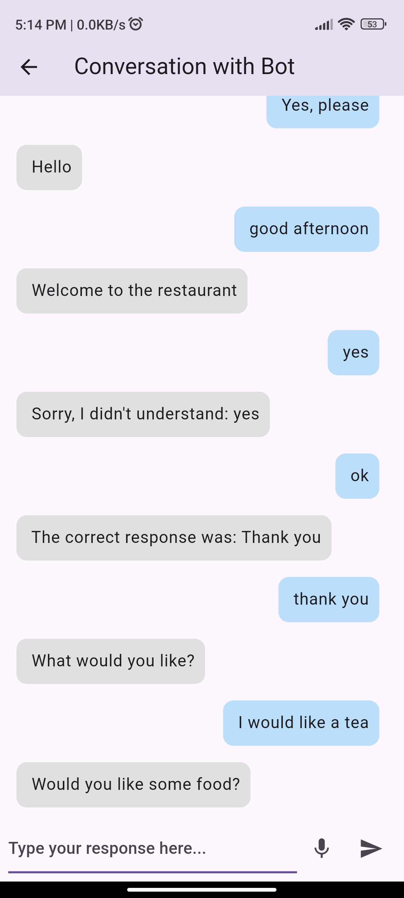
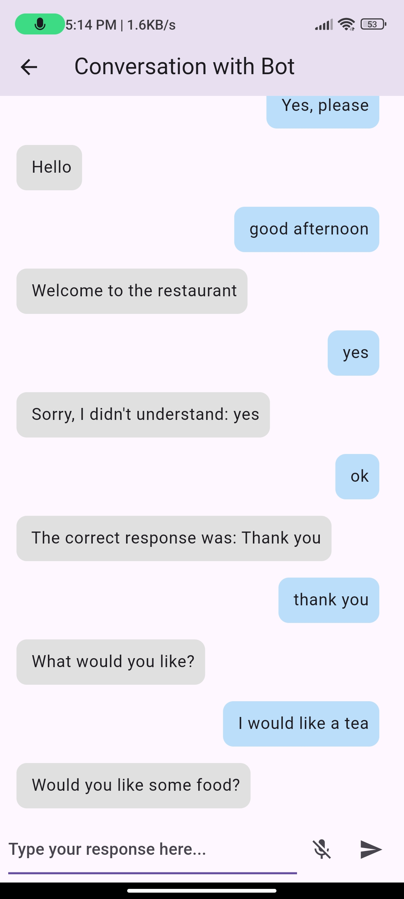

# Sivi Intern Assessment App

This project is an **English Tutor App** that simulates a conversation between the user and a bot, allowing users to practice spoken English. The app uses **speech-to-text** functionality to capture user input and provides real-time feedback based on predefined conversations fetched from an API. The app also supports text-based input and is designed for a smooth and responsive user experience.


## Features

- **Speech-to-Text Integration**: Users can interact with the bot via voice commands using the device's microphone.
- **Real-time Chat Feedback**: The bot provides feedback on user input (both typed and spoken) based on predefined responses from the API.
- **API Integration**: The app fetches conversation data from a mock API, simulating dynamic conversation handling.
- **Text Input Support**: Users can type their responses as an alternative to speech input.
- **Auto-scrolling**: The chat view automatically scrolls to the latest message.
- **In-memory Data Handling**: Conversations are handled using in-memory storage (no Firebase/Firestore integration in this version).

## Screenshots

| Dashboard                        | Chat Screen Mic Off                                 |      Chat Screen Mic On                       | 
|----------------------------------|-----------------------------------------------------|------------------------------------------------|
|  |  |  

## Getting Started

### Prerequisites

To run this app, you need to have:

- **Flutter SDK** installed on your local machine. You can download it from [Flutter's official website](https://flutter.dev/docs/get-started/install).
- **Android Studio** or **VS Code** with Flutter/Dart plugins for running and testing the app.

### Setup Instructions

1. **Clone the Repository**:
   ```bash
   git clone https://github.com/Mohd-Yasir/new_app.git
   cd new_app
   ```

2. **Install Dependencies**:
   Install the required packages and dependencies by running:
   ```bash
   flutter pub get
   ```

3. **Run the App**:
   You can run the app on an Android emulator or physical device using the following command:
   ```bash
   flutter run
   ```

4. **Build the APK (Optional)**:
   If you'd like to generate a release APK for testing, run:
   ```bash
   flutter build apk --release
   ```

### Permissions

The app requires microphone access for speech-to-text functionality. Make sure you enable the following permission in your `AndroidManifest.xml`:

```xml
<uses-permission android:name="android.permission.RECORD_AUDIO"/>
```

You should also handle runtime permissions in your app to request microphone access.

## App Architecture

The app is built using the **MVC (Model-View-Controller)** architecture. The main components of the app include:

1. **Model**:
   - `conversation_model.dart`: Defines the structure of a conversation between the bot and the user.

2. **View**:
   - `conversation_screen.dart`: The main user interface that handles the chat interactions.
   - `dashboard_page.dart`: Displays the previous chat history and the option to start a new conversation.

3. **Controller**:
   - `conversation_controller.dart`: Manages conversation logic, fetching data from the API, and handling user responses.

## Design Choices

1. **Speech-to-Text Integration**: We chose **speech-to-text** using the `speech_to_text` package to allow users to speak and practice English conversation naturally.
2. **In-Memory Storage**: Instead of using Firebase or Firestore, we opted for a simpler approach using in-memory storage to manage chat history and responses for quick local testing and development.
3. **API-based Conversations**: The bot's conversations and responses are fetched from a mock API to simulate dynamic and expandable chat scenarios.

## Mock API

The app uses a mock API for conversations. The API URL is:
```plaintext
https://my-json-server.typicode.com/tryninjastudy/dummyapi/db
```

The structure of the response:
```json
{
  "restaurant": [
    {
      "bot": "Hello",
      "human": "Good afternoon"
    },
    {
      "bot": "Welcome to the restaurant",
      "human": "Thank you"
    },
    ...
  ]
}
```

## Known Issues and Future Improvements

- **No Persistent Storage**: Currently, the chat data is stored only in memory and is not persistent. A future improvement would be integrating Firebase or local storage for saving conversation history.
- **Limited Error Handling**: There is basic error handling for API requests. Future versions could improve error reporting and retry mechanisms.

## Contributing

If you'd like to contribute to this project:

1. Fork the repository.
2. Create a new branch (`git checkout -b feature-name`).
3. Make your changes and commit them (`git commit -m 'Add some feature'`).
4. Push to the branch (`git push origin feature-name`).
5. Open a pull request.

## License

This project is licensed under the MIT License.

---
